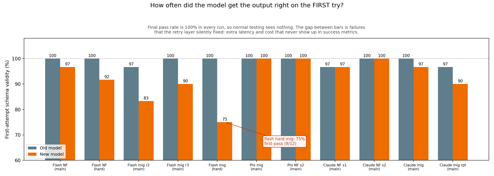
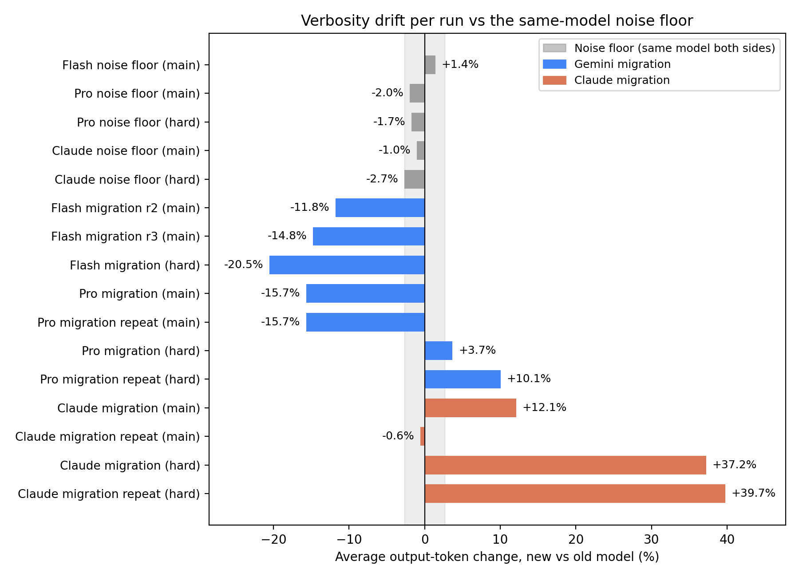
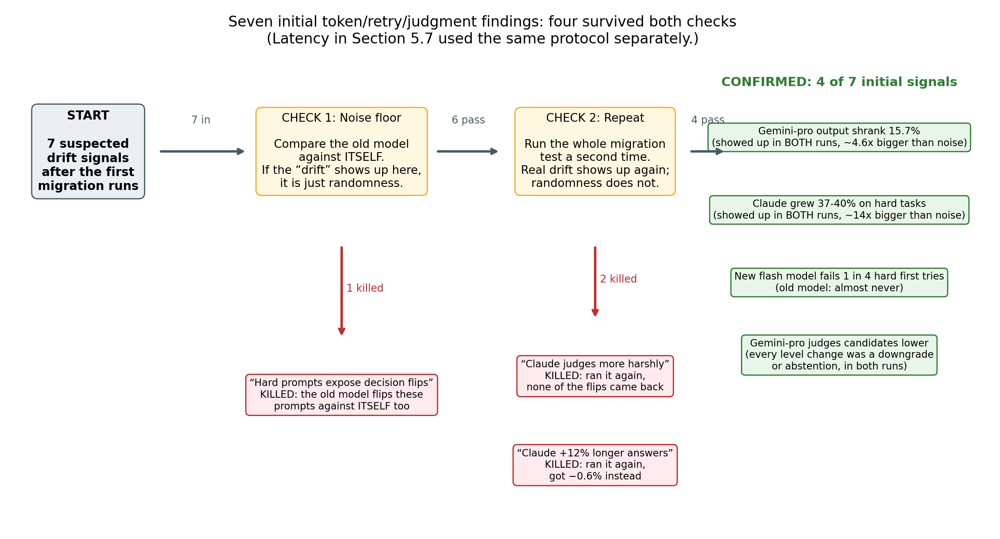

## 1. Introduction

Teams operating LLM-backed production systems face a recurring obligation: migrate to a new model. Provider deprecation timelines, cost restructuring, and capability improvements all produce the same pressure. The standard safety check is straightforward: run the evaluation suite, confirm outputs still validate against your schemas and pass your tests. This check is fast, intuitive, and nearly useless.

Across 19 benchmark runs of two production migrations, schema-level validation flagged zero regressions; meanwhile output volume shifted up to 40% and one migration changed its assessments of human candidates in only one direction: downward.

Those migrations were Gemini 2.5→3.1 (flash and pro tier) and Claude sonnet-4-5→4-6. In every configuration, every suite, every run: 100% eventual pass rate. A standard regression gate would have concluded all migrations were safe. What it missed: one migration shrank average output by 15.7%, reproduced identically across two independent runs; another grew output on difficult tasks by 37–40%; a cheaper model tier began failing 25% of hard first attempts, rescued silently by the retry layer (the automatic re-submission that happens when an output fails validation); and a pro-tier migration changed candidate-level assessments only downward or to "unknown", never upward, across two independent runs.

This paper makes three contributions. First, a measuring tool. Standard migration testing asks one question: does the output still validate? Our framework asks six: did the model pass on its first attempt or did a retry rescue it, how many retries did it need, did output volume change, did latency change, did individual fields change shape, and did any final decision (hire or no hire, pass or fail, proceed or block) flip on the same input. Second, a warning about noise. When we first ran the tool, we found what looked like seven drift signals. We then applied two checks: comparing the old model against itself (a noise floor) and re-running every migration test (repeats). Three of the findings evaporated under those checks: hard-prompt decision instability, a cross-provider judgment-harshness pattern, and a 12% Claude verbosity shift. They were not drift; they were the model's own randomness fooling us. Reporting how we almost fooled ourselves is as important as reporting what survived. Third, the receipts. We release the framework, schemas, prompts, and all raw results so anyone can re-run the study and check the numbers.

The broader lesson is not that models drift. The lesson is that drift is universal but its direction is not. Gemini shrank output; Claude grew it. Gemini-pro recalibrated human candidate assessments; Claude-sonnet did not. No rule of thumb predicts what a given migration will do. The only reliable approach is to measure it: against a noise floor, with repeats, on your own task distribution.

---

## 2. Related Work

BIG-bench [Srivastava et al., 2023], HELM [Liang et al., 2022], and the LM Evaluation Harness [Gao et al., 2023; Biderman et al., 2024] established the paradigm of fixed-prompt evaluation for language models, but these are designed to characterize absolute capability at a point in time, not to detect behavioral change across a specific version transition. The migration-testing problem is structurally different: the prompt set is fixed, the model pair is specific, and the question is not "how capable is this model" but "how did it change and does that matter for my pipeline."

Sculley et al. [2015] and Breck et al. [2017] established rubrics for testing production ML systems and identified regression testing as a first-class production concern. Their frameworks treat regression as binary: a test case passes or fails against a reference output. For structured-output tasks with schema contracts, the reference output is the schema, and as we show, schema compliance can remain at 100% across a migration that changes output volume by 40% and shifts judgment in a consistent direction. Binary regression gates are necessary but not sufficient.

Song et al. [2024] and Atil et al. [2024] document that individual models produce different outputs across runs, including at temperature=0. Atil et al. find accuracy swings up to 15% and best-to-worst performance gaps up to 70% across eight tasks even with deterministic settings. Our contribution is separating within-model sampling variance from between-model migration effects, using empirical self-vs-self noise floor runs rather than analytic estimates. Khatchadourian and Franco [2025] independently quantify LLM output drift across providers for financial workflows, proposing mitigation strategies that complement our measurement approach.

Structured output enforcement has become standard practice for production LLM pipelines. Willard and Louf [2023] formalize constrained generation as finite-state machine transitions, enabling token-level enforcement of output schemas with minimal overhead. Geng et al. [2025] benchmark structured output generation across six constrained decoding frameworks using 10K real-world JSON schemas. Our framework uses the `instructor` library, which enforces schemas via validation-error feedback and retries rather than constrained decoding, and adds pre-retry first-attempt monitoring, exposing a failure mode (retry-masking) that compliant infrastructure hides by design.

Zheng et al. [2023] proposed using strong LLMs as judges for evaluating open-ended outputs and characterized position, verbosity, and self-enhancement biases in LLM judges. Wang et al. [2022] showed through self-consistency sampling that LLM outputs vary meaningfully across samples, and that majority-vote aggregation substantially improves accuracy on reasoning tasks. A recent survey [Gu et al., 2024] covers reliability, calibration, and inter-rater agreement of LLM evaluators comprehensively. Our finding that the Gemini-pro migration produces directional shifts in candidate-level assessment (all changes downward or to abstention across two independent runs, none upward) is not the kind of random flip these works describe. Systematic directional drift requires direction-sensitive flip tracking with reproducibility controls, not just flip counts.

Shankar et al. [2022] document recurring production ML challenges (data drift, monitoring gaps, retraining triggers) through interviews with 18 ML engineers. More recent work on LLMOps [Pahune et al., 2025] surveys how deployment pipelines must evolve specifically for large language models. Our framework targets the production gap these works identify: outputs are schema-validated but not ground-truth-labeled, so behavioral shifts pass through undetected.

---

## 3. Framework

### 3.1 Architecture

The framework takes two inputs: a directory of prompt files (`.txt`, one task per file) and a directory of Pydantic schema files (`.py`; Pydantic is a Python library that defines data contracts: the exact fields, types, and allowed values the model's output must have). Each prompt is submitted to both the old and new model; outputs are validated against the corresponding schema using `instructor`, an open-source Python library that, when a response fails validation, sends the error message back to the model and asks it to retry, up to 3 times. A hook before any retry fires captures whether the raw first response passed. Results are written to a `.jsonl` file (one record per prompt) and a human-readable summary report. The complete framework, prompts, schemas, and raw results are released at https://github.com/srikarpunna/drift-predictor.

### 3.2 Metrics

The framework records seven signal classes beyond binary pass/fail: one for each of the six questions in the Introduction, plus compound drift flags derived from them.

**First-attempt validity.** Before instructor has a chance to retry, did the model's raw first response pass validation? A pre-retry hook captures this. Standard pass/fail reporting never surfaces it: the retry happens invisibly and the final result looks clean.

**Retry counts.** Per-prompt attempt counts (maximum 3). A model that needs 3 attempts on a straightforward prompt has failed in a way pass/fail will never tell you.

**Output token counts.** Average tokens per response, reported as delta (new average − old average) and percentage change. This is the primary volume-drift signal. One precision: `instructor` accumulates usage across its validation retries, so the recorded count measures the tokens consumed to obtain a compliant response; for any run with 100% first-attempt validity it equals the final response size exactly.

**Request latency.** Wall-clock milliseconds per request, including any retry round-trips. Latency drift can move independently of token drift (Section 5.7) and is the noisiest of the seven signals, so it is held to a stricter reproducibility bar.

**Field-level structural drift.** For list fields, the change in list length (`__len`); for string fields, the change in character count (`__chars`). Events are flagged when the delta exceeds 40%. This surfaces changes to individual output components, for example a model that shortens summary fields while leaving numeric fields intact.

**Aggregate drift flags.** Compound per-prompt booleans: `verbosity_grow`, `verbosity_shrink` (±25% overall), `structure_drift` (any field event), `content_shrink`.

**Decision-field flips.** For fields representing high-stakes categorical decisions (`recommended_action`, `overall_recommendation`, `candidate_level_assessed`, `overall_grade`, `escalation_required`), a flip is recorded when the new model's value differs from the old model's value on the same input. For example: 'hire' becoming 'no_hire', or 'proceed_migration' becoming 'block_migration'. These are the signals most directly relevant to behavioral risk in human-impacting pipelines. Flip detection is implemented in the framework (`drift_metrics.decision_flips`); every flip count in this paper is reproducible from the released raw results via `scripts/analyze_flips.py`, which recomputes flips directly from the recorded outputs.

### 3.3 The Two Controls

A single migration run cannot distinguish model change from sampling randomness. The framework requires two controls applied together:

**Noise floor.** Run the same suite with the old model on *both sides* of the comparison (old model as both "old" and "new"). Any signal this produces is within-model variation. Migration signals that do not exceed this baseline must be discarded. Without it, every non-deterministic model looks like it drifted against any comparison.

**Migration repeats.** Re-run each migration configuration at least once. Sampling artifacts reproduce unpredictably; systematic drift reproduces reliably. A finding that appears in run 1 but not run 2 is a false positive.

Together these controls apply a simple decision rule: a migration signal is real only if it exceeds the noise floor *and* reproduces across runs. Both conditions are necessary; neither is sufficient alone.

One precision applied consistently throughout this paper: the noise floor for any comparison is the floor matched to the *same prompt suite and the same model tier* as the migration run. Section 6.1 shows concretely why a borrowed floor misleads: a prompt that is noise-floor-stable for one tier can be a coin flip for another. Where the text quotes a cross-run band (for example the widest swing across all eight noise floors in Figure 2), that band is descriptive context for the reader; the evidence bar for every claim is the matched floor.

---

## 4. Experimental Setup

### 4.1 Schemas and Prompts

Three output schemas were designed to cover representative high-stakes structured-output tasks:

- **`diagnostic`**: QA migration diagnostic report. Key fields: `recommended_action` (must be one of `"proceed_migration"`, `"block_migration"`, or `"conditional_proceed"`; no other value accepted), `regression_rate_pct`, `regression_by_family` list. Cross-field validators (rules that check consistency between fields after the model fills them in) enforce arithmetic accuracy between the rate fields and the breakdown list.
- **`interview_evaluation`**: Technical interview panel evaluation. Key fields: `overall_recommendation` (one of `"hire"`, `"no_hire"`, `"hold"`), `candidate_level_assessed`, `panel_recommendation` (one of `"advance"`, `"decline"`, `"defer"`, and it must be consistent with `overall_recommendation`). A `@model_validator` (a Pydantic decorator that runs custom logic after parsing) enforces this cross-field rule.
- **`support_audit`**: Customer support call audit. Key fields: `overall_grade` (one of `"PASS"`, `"COACH"`, `"FAIL"`), `compliance_score_pct`, `escalation_required`, nested `HoldEvent`.

All enum-like fields use `typing.Literal`, Python type annotations that restrict a field to a specific set of allowed strings and reject anything else at parse time. Previously these fields were just plain `str` with descriptions; the Literal hardening was applied before any model runs.

Two prompt suites were used:

- **Main suite**: 30 prompts (10 per schema), representative of normal production task complexity and well-specified instructions.
- **Hard suite**: 12 prompts (4 per schema), designed to stress-test specific failure modes: edge-case inputs, competing instructions in the prompt, cross-field consistency traps, and intentional underspecification. These prompts were built to sit right on decision boundaries, cases where a reasonable model could go either way.

To rule out post-hoc tuning: all prompts and schemas were frozen before the runs they are analyzed in, and no prompt was modified in response to any analyzed result. The main suite predates every analyzed run. The hard suite was authored on 2026-06-09, after the main-suite flash runs motivated it but before the first hard-suite run, and was never edited afterward; this is verifiable from the released artifact, where per-prompt input token counts are identical across all eight hard-suite runs and across every main-suite run sharing the same old model (the only exceptions are exact integer multiples of the same base count, produced by retry accumulation, not text changes).

### 4.2 Model Pairs and Runs

Three migration pairs were evaluated:

| Pair | Old model | New model |
|------|-----------|-----------|
| Gemini Flash | `gemini-2.5-flash` | `gemini-3.1-flash-lite` |
| Gemini Pro | `gemini-2.5-pro` | `gemini-3.1-pro-preview` |
| Claude Sonnet | `claude-sonnet-4-5-20250929` | `claude-sonnet-4-6` |

**Table 1.** The three migration pairs evaluated.

All analyzed runs were conducted on 2026-06-09 and 2026-06-10. Six earlier pilot runs from 2026-05-27 and 2026-05-30 are included in the released data but excluded from analysis: they predate the first-attempt instrumentation and the `Literal` schema hardening, so their records are not comparable to the final protocol. One additional June flash migration run (r1, the shakedown run immediately after the instrumentation was added) is released but excluded from the tables because it predates the serialized field-drift records; the flash main-suite runs are therefore numbered r2 and r3. Its aggregates match them (−15.4% tokens, 25/30 new-model first-pass).

Total analyzed runs: 19, comprising 2 flash migration main-suite runs, 1 flash hard-suite run, 2 flash noise floors (main and hard), 2 pro migration main runs, 2 pro migration hard runs, 3 pro noise floors (two main sessions and one hard), 2 Claude migration main runs, 2 Claude migration hard runs, and 3 Claude noise floors (two main sessions and one hard). The flash hard noise floor and the second pro and Claude main-suite noise-floor sessions were run after the first round of analysis, specifically to close two gaps the analysis itself exposed: hard-suite flips need a matched-suite, matched-tier noise baseline (Section 6.1), and a single noise-floor session underestimates session-to-session variance (Section 6.3). Tables abbreviate run labels where space is tight: NF = noise floor, mig = migration, rpt = repeat.

### 4.3 Provider Configuration

Both providers used the `instructor` library with `max_retries=3` and structured-output mode. A hook fires on each `COMPLETION` call to record token counts; a separate hook fires on `PARSE_ERROR` (when the first response fails schema validation) to capture the error details for retry-masking analysis. No model-specific prompt tuning was applied; the same prompt text went to every model in every run.

Three configuration details affect interpretation and are disclosed for fairness:

- **Output ceilings differ by provider.** Claude calls set `max_tokens=4096`; Gemini calls used the provider default ceiling (higher). Gemini outputs peaked well below either limit, so this asymmetry does not affect the Gemini token deltas. A handful of the longest Claude responses (in `interview_evaluation`) approached the 4096 cap, and at least two first-attempt failures in the Claude main-suite runs are consistent with truncation at the cap rather than a pure schema failure. The Claude hard-suite runs, where the surviving Claude claims live, peak at ~3,700 tokens with zero retries, so they are unaffected.
- **Token counts accumulate across retries.** As noted in Section 3.2, a retried response records the tokens of all attempts. All surviving token claims come from runs with 100% (pro) or near-100% first-attempt validity, where this accumulation is zero or negligible. For the flash migration, retries occur on the *new* side, so accumulation makes the measured shrinkage conservative (the true final-response shrinkage is larger than reported).
- **Gemini token counts exclude internal reasoning.** Our instrumentation records the SDK's `candidates_token_count`, the visible response; the SDK reports reasoning separately as `thoughts_token_count`, which is billed as output but not counted here. This matters for the cost analysis in Section 7.4.

Transport-level retries (a `tenacity` wrapper for transient network and API errors) sit outside the instructor loop and are excluded from validation-attempt counts; no analyzed run shows attempt counts exceeding instructor's own retry budget, confirming the transport layer never re-ran a validation cycle.

### 4.4 Statistical Analysis

Each prompt yields a paired observation (old model tokens, new model tokens), so token-delta claims are tested on per-prompt paired deltas. For every run we report the mean delta with a 95% confidence interval from a paired bootstrap (10,000 resamples of prompts with replacement) and a p-value from a sign-flip permutation test (10,000 permutations; null hypothesis: deltas have no systematic direction). The analysis script (`scripts/compute_stats.py`) is included in the released artifact.

---

## 5. Results

### 5.1 Pass/Fail: The Blind Baseline

Every model. Every run. Every suite. 100% eventual pass rate.

Both old and new models produce schema-valid output on all 42 prompts in every configuration tested. A standard "does it validate" evaluation would conclude every migration is safe. Everything in the following sections is what that conclusion misses.

### 5.2 Retry-Masking: Hidden Strain in the Cheap Tier

Retry-masking is what happens when instructor's retry loop silently fixes failures: the final output looks fine, but the model failed on its first attempt and needed error-feedback to get there. This costs latency and API calls in production, and it tells you the model is running closer to its constraint-satisfaction limit than the pass/fail number suggests.

First-attempt validity, measured before any retry, reveals a clear divide by capability tier:

| Run | Old first-pass | New first-pass |
|-----|---------------|----------------|
| Flash mig. r2 (main) | 29/30 (96.7%) | 25/30 (83.3%) |
| Flash mig. r3 (main) | 30/30 (100.0%) | 27/30 (90.0%) |
| Flash mig. (hard) | 12/12 (100.0%) | **9/12 (75.0%)** |
| Flash NF (main) | 30/30 (100.0%) | 29/30 (96.7%) |
| Flash NF (hard) | 12/12 (100.0%) | 11/12 (91.7%) |
| Pro migration (all) | 100% | 100% |
| Pro NF s2 (main) | 30/30 (100.0%) | 30/30 (100.0%) |
| Claude mig. r1 (main) | 30/30 | 29/30 |
| Claude mig. rpt (main) | 29/30 | 27/30 |
| Claude NF s1 (main) | 29/30 | 29/30 |
| Claude NF s2 (main) | 30/30 | 30/30 |

**Table 2.** First-attempt schema validity per run (valid first responses / prompts), before any retry.

**Figure 1.** How often each model produced schema-valid output on its first try. Every run still ends at a 100% pass rate after retries, so standard testing reports no difference between any of these runs. The gap between the two bars in each pair is the failure rate the retry layer silently absorbed. To read one pair: in Flash migration r2, the old model's first answer was valid on 29 of 30 prompts (97) while the new model managed only 25 of 30 (83); those five rescued failures are invisible in success metrics but cost real latency and API calls. The noise floor pairs on the same chart show how big this gap gets with no model change at all (about 3 points), so only the flash tier's 14 to 25 point gaps are meaningful.

The new flash model fails 10–25% of first attempts, concentrated in `interview_evaluation` (the most constraint-dense schema), and nearly all are silently rescued. The hard suite is worst at 75% first-pass. The pro tier has no such problem in any run. The Claude sonnet tier shows 1–3 retries per 30 main-suite prompts, comparable to the old model's own rate (0–1), and zero retries on both hard-suite runs. Retry-masking is a capability-tier effect, not a universal migration risk.

What the failures actually are matters, because a skeptic could attribute first-attempt failures to formatting quirks (markdown-wrapped JSON, unexpected enum casing) rather than capability. The recorded error messages, released with the raw results, rule this out: none of the new flash model's first-attempt failures are parse or formatting errors. They fall into three semantic categories. First, content omission: required `reasoning` fields returned empty or near-empty (`""`, "N/A for final interview.") against a 25-character minimum, the verbosity shrinkage of Section 5.3 pushed past the point of violating content contracts. Second, cross-field logic: asserting `followup_required=True` while omitting the required `followup_reason` (five instances across runs). Third, arithmetic: a reported rate inconsistent with its own breakdown counts. These are constraint-satisfaction failures, not serialization ticks, which is what makes the first-attempt signal a capability measure rather than a formatting one.

### 5.3 Verbosity Drift: Opposite Directions, Both Reproducible

Output token averages per response are the most consistent signal in the study. For scale: these tasks produce substantial structured reports, averaging roughly 1,500 output tokens per response for Gemini and 1,800–2,700 for Claude, so the percentage deltas below correspond to hundreds of tokens per request.

**Gemini (main suite):**

| Comparison | Old avg | New avg | Delta | 95% CI (tokens) | p |
|-----------|---------|---------|-------|-----------------|---|
| Flash noise floor (main) | 1532.7 | 1554.5 | +21.9 (+1.4%) | [−49.1, +105.2] | 0.61 |
| Flash noise floor (hard) | 1108.5 | 1176.2 | +67.8 (+6.1%) | [+9.4, +125.8] | 0.06 |
| Flash migration r2 | 1505.8 | 1328.4 | −177.3 (−11.8%) | [−270.5, −82.7] | 0.001 |
| Flash migration r3 | 1552.3 | 1322.8 | −229.6 (−14.8%) | [−286.2, −174.5] | <0.001 |
| Pro noise floor s1 | 1588.9 | 1557.6 | −31.3 (−2.0%) | [−69.4, +3.0] | 0.11 |
| Pro noise floor s2 | 1549.8 | 1602.3 | +52.4 (+3.4%) | [+15.3, +93.1] | 0.013 |
| **Pro migration** | **1576.8** | **1330.0** | **−246.8 (−15.7%)** | [−327.6, −172.3] | <0.001 |
| **Pro migration repeat** | **1585.3** | **1337.0** | **−248.3 (−15.7%)** | [−332.1, −166.8] | <0.001 |

**Table 3.** Gemini main-suite output tokens per response: noise floors vs migrations, with paired-bootstrap CIs and permutation p-values.

The pro migration delta is −15.7% in both runs (the two numbers are nearly identical). Its matched floor, the two pro main-suite noise sessions, swings −2.0% and +3.4%, and the two sessions do not even agree on a direction. The evidence for the claim is the pair of confidence intervals excluding zero (p < 0.001 in both runs, same sign both times) against a matched floor whose intervals include zero or barely exclude it; the "roughly 4.6× the wider noise session" multiplier we quote alongside is a descriptive summary of point estimates, not the statistical test. The Gemini 3.1 generation is systematically terser; this is a migration effect, not sampling randomness, and the repeats confirm it is stable.

The second pro noise-floor session deserves a highlight: its +3.4% swing is nominally significant (p = 0.013) despite being the same model compared against itself. A same-model run can pass a significance test. This is the strongest single piece of evidence in the study for the paper's central protocol: statistical significance within one session establishes only that the deltas were directional in that session, not that the model changed. Magnitude relative to the noise floor plus reproduction across runs is the evidence standard; significance alone is not.

**Claude (main and hard suites):**

| Comparison | Old avg | New avg | Delta | 95% CI (tokens) | p |
|-----------|---------|---------|-------|-----------------|---|
| Claude noise floor s1 (main) | 2524.0 | 2498.3 | −25.7 (−1.0%) | [−118.3, +72.4] | 0.62 |
| Claude noise floor s2 (main) | 2365.4 | 2381.9 | +16.5 (+0.7%) | [−54.3, +85.2] | 0.66 |
| Claude noise floor (hard) | 1856.2 | 1806.5 | −49.8 (−2.7%) | [−148.8, +49.0] | 0.36 |
| Claude migration (main) | 2374.0 | 2661.0 | +286.9 (+12.1%) | [+129.7, +497.9] | <0.001 |
| Claude migration (hard) | 1865.8 | 2560.6 | +694.8 (+37.2%) | [+515.7, +858.8] | <0.001 |
| Claude migration repeat (main) | 2703.8 | 2688.4 | −15.4 (−0.6%) | [−680.0, +407.0] | 1.00 |
| **Claude migration repeat (hard)** | **1814.5** | **2535.6** | **+721.1 (+39.7%)** | [+532.4, +899.5] | 0.001 |

**Table 4.** Claude output tokens per response, main and hard suites, same statistics as Table 3.

Across the eight noise-floor runs in the study, six have confidence intervals including zero; the two that do not (the flash hard floor at +6.1% and the second pro main session at +3.4%) do not reproduce across sessions and do not agree in direction with anything. The reproduced headline signals (flash and pro shrinkage, Claude hard growth) all have confidence intervals excluding zero and p ≤ 0.006 in both of their runs, with the same sign both times.

The hard-suite growth is the robust finding: +37.2% and +39.7% across two independent runs, with confidence intervals far from zero in both, against a matched noise floor of −2.7% whose interval includes zero. (Approximately 14× the matched floor's point estimate, with the same descriptive caveat as above.) Sonnet-4-6 spends substantially more tokens on difficult inputs.

The main-suite claim did not reproduce (+12.1% run 1, −0.6% repeat) and is addressed as a false positive in Section 6.

The cross-provider contrast is sharp: the Gemini 3.1 generation shrinks output ~16% (reproduced twice); Claude 4-6 grows output ~38–40% on hard tasks (reproduced twice). Same type of migration event; opposite directions. There is no universal rule.

**Figure 2.** How much average output length changed in each run. To read one bar: −15.7% on the pro migration means the new model's answers averaged 15.7% fewer tokens than the old model's on the same 30 prompts. Gray bars compare the old model against itself, so they show pure randomness; the shaded band marks the widest such swing observed across all eight noise-floor runs (±6.1%, set by the flash hard floor). The band is descriptive context, a quick visual answer to "how big can a no-change run look?"; the evidence bar for each claim is the noise floor matched to that run's own suite and tier (Section 3.3), together with the confidence intervals in the tables above. The reproduced signals (Gemini shrinking ~16%, Claude growing 37–40% on hard tasks) clear both bars in both of their runs, in opposite directions.

### 5.4 Adaptive Effort: Easy and Hard Prompts Diverge (Gemini-Pro)

The Gemini-pro migration reveals a second layer:

| Run | Suite | Token delta |
|-----|-------|-------------|
| Pro migration | main | −246.8 (−15.7%) |
| Pro migration | hard | **+36.3 (+3.7%)** |
| Pro migration repeat | hard | **+96.5 (+10.1%)** |
| Flash migration | hard | −227.5 (−20.5%) |

**Table 5.** Token deltas by suite for the Gemini migrations: the pro tier inverts direction between easy and hard prompts; the flash tier does not.

The new pro model is terser on routine tasks but spends more tokens on hard ones. This claim deserves a candid grading against the paper's own standard. The matched hard-suite pro noise floor is −1.7%, but the run-1 effect of +3.7% is small: it sits inside the widest cross-floor band in Figure 2 and, taken alone, would be directionally suggestive at best. The evidence is the repeat: +10.1% in the second run, same direction, against a matched floor that moved the *opposite* way. We report the finding as a reproduced direction with a modest first-run magnitude, weaker than the headline verbosity results in Section 5.3, and the practical lesson stands regardless: the flash model shrinks regardless of task difficulty, while the pro model's drift inverts between easy and hard inputs. Verbosity drift measured on an easy eval suite does not predict what the model does on complex production inputs. You need both suites to see this.

### 5.5 Structural Drift: 2-3x Noise Across Providers

Field-level event counts (list-length and string-length changes exceeding 40%) show consistent separation from noise in both providers:

| Run | Prompts flagged | Field events |
|-----|-----------------|--------------|
| Gemini pro noise floor (main) | 16/30 | 43 |
| Gemini pro migration (main) | 26/30 | 83 |
| Claude noise floor (main) | 20/30 | 44 |
| Claude migration (main) | 27/30 | 121 |
| Claude noise floor (hard) | 10/12 | 30 |
| Claude migration (hard) | 12/12 | 91 |

**Table 6.** Field-level drift events (list-length or string-length changes exceeding 40%) per run.

Migration produces approximately 2× (Gemini) to 2.7–3× (Claude) the field-level events of self-vs-self variation. Structural drift appears across both providers and is not simply explained by the token-volume effect: individual string and list fields change independently of overall verbosity.

### 5.6 Judgment Drift: Directionally Consistent Downgrading (Gemini-Pro)

Decision-field flip counts alone are misleading; Section 6 explains why. The full table is shown here for reference; the noise-floor-and-repeat filters are applied before any finding is stated. Final-decision fields are `recommended_action`, `overall_recommendation`, `overall_grade`, and `escalation_required`; `candidate_level_assessed` flips are counted in the flip total but not as final decisions.

| Run | Suite | Flips | Final-decision flips |
|-----|-------|-------|---------------------|
| Flash noise floor | main | 1 (level only) | 0 |
| Flash noise floor | **hard** | 2 | **2** |
| Pro noise floor s1 | main | 2 (level only) | 0 |
| Pro noise floor s2 | main | 4 | 1 |
| Pro noise floor | **hard** | 3 | **3** |
| Claude noise floor s1 | main | 1 (level only) | 0 |
| Claude noise floor s2 | main | 1 (level only) | 0 |
| Claude noise floor | **hard** | 2 | **2** |
| Flash migration r3 | main | 4 | 1 |
| Flash migration | hard | 7 | 4 |
| Pro migration | main | 4 (all level) | 0 |
| Pro migration | hard | 3 | 3 |
| Pro migration repeat | main | 4 (all level) | 0 |
| Pro migration repeat | hard | 2 | 2 |
| Claude migration | main | 1 | 0 |
| Claude migration | hard | 3 | 2 |
| Claude migration repeat | main | 2 | 0 |
| Claude migration repeat | hard | 1 | 1 |

**Table 7.** Decision-field flips per run; final-decision flips are the subset on `recommended_action`, `overall_recommendation`, `overall_grade`, or `escalation_required`. Reproducible via `scripts/analyze_flips.py`.

After applying both controls, two findings survive as genuine judgment drift:

**Directional candidate-level recalibration (Gemini-pro, main suite).** Across both pro migration main-suite runs, the new model changed `candidate_level_assessed` on 8 prompt-run instances. Every change moved down a level (`L6→L5`) or retreated to `unknown`; none moved up. The two pro noise-floor sessions provide the contrast: their level flips are upward assignments (`unknown→L4`, three times across both sessions) or abstention retreats (`L5→unknown`, `L4→unknown`); no noise-floor session ever produced a strict downgrade. Two caveats keep this claim honest. First, prompts 002, 003, and 006 are unstable in the old model itself (they flip in the noise floors), so their migration flips should be discounted; the second noise-floor session also shows that abstention retreats occur in pure noise, so retreats to `unknown` carry little evidential weight on their own. Second, the second noise-floor session produced one final-decision flip of its own (`hold→hire` on prompt 004), confirming that prompt's recommendation field is boundary-unstable. The defensible core survives both caveats: the strict `L6→L5` downgrade on three distinct prompts (001, 004, 005), with prompt 005 reproducing exactly in both runs; no pro noise-floor session produced a strict downgrade on any prompt. Combined with the complete absence of upward changes across all pro migration runs, the direction is consistent: the new pro model assesses candidate seniority lower or declines to assess it.

A formal directionality test is possible and we state it with its limits. Under a null of symmetric flipping, all 8 migration flip instances landing in the downward/abstention direction has a one-sided sign-test probability of 0.004; but the instances are not independent (the same prompts recur across runs, and three of them are boundary-unstable), so this p-value is an upper bound on the evidence, not a clean test statistic. Restricted to the strict-downgrade core, three prompts is too few for significance (one-sided p = 0.125 under the same null). The claim therefore rests on the conjunction the protocol was built for, reproduced direction plus a clean matched noise floor, not on a significance test, and we label it directionally consistent rather than established. The right confirmatory experiment, sampling the contested prompts repeatedly under both models to measure the actual decision distributions, is future work.

**COACH→FAIL support grade (Gemini-pro, hard suite).** The `overall_grade` field in the support audit schema flipped from `COACH` to `FAIL` on the same hard-suite prompt in both pro migration runs, and never flipped in the pro noise floor on any run. This is the cleanest single-prompt judgment-drift signal in the study: same value change, reproduced twice, clean noise-floor negative. One disclosure keeps the claim precise: the same prompt *does* flip in the flash-tier hard noise floor, so the prompt sits near a grading boundary in general. The claim is tier-matched: at pro tier the noise floor is stable and the migration reproduces the same directional flip twice, which is exactly the evidence standard Section 3.3 requires. Appendix A shows the two models' full assessments of the identical call transcript side by side.

No equivalent directional or reproducible judgment pattern appeared in the Claude migration. Claude's judgment flips are addressed in Section 6.

### 5.7 Latency Drift: Terser but Slower

The framework records wall-clock latency per request (including any retry round-trips). Latency is the noisiest metric in the study: the pro hard-suite noise floor swings −11.3% and the flash hard floor +8.9% on their own, wider than any token noise floor. Claims below are restricted to signals that are reproduced and statistically separated from that wider band.

*Noise floors:*

| Run | Old avg (s) | New avg (s) | Delta | p |
|-----|------------|------------|-------|---|
| Pro NF s1 (main) | 32.1 | 32.2 | +0.2% | 0.95 |
| Pro NF s2 (main) | 30.2 | 31.3 | +3.5% | 0.38 |
| Pro NF (hard) | 26.4 | 23.4 | −11.3% | 0.15 |
| Flash NF (hard) | 18.4 | 20.0 | +8.9% | 0.27 |
| Claude NF s1 (main) | 51.1 | 50.2 | −1.9% | 0.46 |
| Claude NF s2 (main) | 44.4 | 44.9 | +1.1% | 0.65 |
| Claude NF (hard) | 33.9 | 33.3 | −1.8% | 0.57 |

**Table 8.** Latency noise floors: same-model latency swings per suite and tier.

*Migrations (reproduced signals in bold):*

| Run | Old avg (s) | New avg (s) | Delta | p |
|-----|------------|------------|-------|---|
| Pro mig. (main) | 30.8 | 36.5 | **+18.3%** | <0.001 |
| Pro rpt main | 32.8 | 38.2 | **+16.6%** | <0.001 |
| Claude mig hard | 35.1 | 46.4 | **+32.3%** | <0.001 |
| Claude rpt hard | 33.1 | 46.4 | **+40.0%** | 0.001 |
| Claude mig main | 46.3 | 49.5 | +6.8% | 0.04 |
| Claude rpt main | 51.2 | 74.7 | +46.0% | 0.25 |
| Flash (3 runs) | 20.4–25.2 | 4.6–5.8 | **−76 to −78%** | <0.001 |

**Table 9.** Migration latency deltas; bold marks signals reproduced across runs.

Three results survive the controls:

**The pro inversion.** The Gemini-pro migration produces 15.7% *fewer* output tokens but takes 17–18% *longer* per request, reproduced in both main-suite runs against a +0.2% noise floor. The inversion itself is measured and solid. Our explanation for it is not: terser output with slower responses is consistent with the new model spending more compute on internal reasoning before answering (the Gemini SDK reports visible output, `candidates_token_count`, which our instrumentation records, separately from internal reasoning, `thoughts_token_count`, which is billed as output but not recorded here). Because we did not log reasoning-token counts, this mechanism remains an unmeasured hypothesis; it is directly testable by adding one field to the instrumentation, and we flag it as the first follow-up experiment. What the data does establish is a third drift dimension: even within a single migration, the drift directions do not agree. Output shrank; latency grew.

**Claude hard-suite slowdown.** +32% and +40% latency, reproduced, tracking its 37–40% verbosity growth. The longer outputs are paid for twice: in tokens and in wall-clock time.

**Flash speedup.** The flash-to-lite migration cuts latency by roughly 77% in all three runs (about 25s to about 5.5s). Drift is not always degradation; this is a large, reproducible improvement, and it coexists with the same migration's first-attempt failures. A team looking only at latency would call this migration a clear win; a team looking only at retry-masking would call it a regression. Both are true.

One latency signal did *not* reproduce: Claude main-suite latency was +6.8% in run 1 and +46.0% in the repeat, with the repeat's confidence interval spanning zero (a single slow session or load variance). Like the Claude verbosity false positive in Section 6.3, this is exactly the kind of signal the repeat protocol exists to filter.

Caveats: latency includes retry round-trips, was measured in single sessions per run, and is exposed to provider load and network variance that token counts are not. The hard-suite noise floor's −11.3% swing shows the practical band; latency claims should be held to a higher reproducibility bar than token claims, as done here.

---

## 6. The False Positives

Half of the drift we initially detected was sampling noise; a same-model noise floor and one repeat run were sufficient to falsify it.

Three findings looked credible after the first migration run. All three were killed by the controls. This section is not a methodological footnote; it is the methodological point of the paper. A single-run comparison without a noise floor would have published all three as results.

**Figure 3.** The filtering pipeline for the seven provisional findings from the first migration runs (tokens, retries, and judgment only). Check 1 (does the old model do this against itself?) killed one. Check 2 (does it happen again on a full re-run?) killed two more. Four survived; those are the core claims in Sections 5.2–5.4 and 5.6. Latency drift (Section 5.7) and field-level structural drift (Section 5.5) were measured under the same noise-floor and repeat protocol but are not counted in this funnel; three latency signals survived there, one did not.

### 6.1 "Hard Prompts Expose Decision Flips" (Killed)

After the first flash migration hard-suite run, 7 decision-field flips were recorded, far more than the main-suite baseline of 0. The initial read: hard prompts reveal judgment instability that easy prompts mask.

Then we ran the hard-suite noise floors: the old model tested against itself on the same hard prompts, with no model change at all. The pro-tier hard noise floor produced 3 final-decision flips on its own, including `diagnostic-104`, the same prompt that flipped in the flash migration. The matched-tier check is more direct: the flash hard noise floor (`gemini-2.5-flash` against itself) produced 2 final-decision flips, including a `COACH→FAIL` grade flip on `support_audit-104`, the very flip that at pro tier is one of this paper's surviving findings. At flash tier it happens with no model change at all. There is no stable "old model answer" to migrate away from on these prompts.

Here's why that happens: the hard prompts are designed to sit right on the edge of a decision. Think of a grading rubric where a candidate's answer is genuinely borderline: a fair evaluator could score it either way. Any model, old or new, will give slightly different answers when the input is that ambiguous. So when you see a flip in a migration run, you cannot tell whether it is because the model changed or because the input is just noisy. Counting those flips as "migration drift" is measuring input ambiguity, not model change.

The fix is simple but easy to miss: run your noise floor on the same prompt suite *and the same model tier* you are analyzing. Comparing hard-suite migration flips against a main-suite noise baseline is an apples-to-oranges comparison, and so is borrowing another tier's noise floor: a prompt that is noise-floor-stable for one model can be a coin flip for another. Without the matched hard-suite noise floor, those 7 flips looked significant. With it, they vanished.

### 6.2 "Claude Judges Candidates More Harshly" (Killed)

After the first Claude migration run, three judgment observations surfaced: an `L6→L5` candidate-level flip on a main-suite prompt, and two hard-suite flips including `hold→no_hire` on `interview_evaluation-104`. The pattern provisionally matched the Gemini-pro downgrade effect, raising the hypothesis that newer models judge more harshly across providers.

The repeat migration run (Claude main suite, run 5) falsified it completely. Not a single flip from run 1 recurred. The repeat produced flips on different prompts entirely, and included an upward flip (`L5→L6`), breaking any downgrade pattern. The hard-suite repeat (run 6) produced one flip on a different diagnostic prompt, not the ones that flipped in run 1.

The "harsher judge" story was a single-run artifact. The Gemini-pro claim survives because its direction was fully consistent across two independent runs (every change downward or to abstention, with one prompt reproducing its exact flip). The Claude claim died because 0 out of the original flips recurred. "Newer models judge more harshly" is a Gemini-pro-specific observation; it cannot be generalized.

### 6.3 "Claude +12% Verbosity on Main Suite" (Killed)

Run 1 of the Claude main-suite migration showed +286.9 tokens average, a +12.1% increase. The noise floor at that time showed −1.0%. The separation looked approximately 12×, and the finding appeared strong. It was even statistically significant: the paired bootstrap CI was [+130.0, +495.0] and the permutation p-value was below 0.001.

Run 5 (migration repeat, main suite) showed −0.6%. The sign had flipped.

This false positive deserves emphasis precisely because it passed a significance test. The permutation test correctly tells you the run-1 deltas were not random noise *within that session*; it cannot tell you the old model's own baseline would move ±7% by the next session. Statistical significance on a single run is not a substitute for the repeat.

Root cause: the old model's average output differed substantially between the two main-suite runs (2374.0 tokens in run 1 vs 2703.8 tokens in run 5). That is a ±7% spread in the old model's own aggregate output across different invocation days, much larger than the single-run noise floor suggested. The noise floor measured in one session estimated instantaneous sampling variance, not how much the old model's aggregate naturally shifts from day to day.

This finding is not fully killed: the hard-suite verbosity result (+37.2% / +39.7%, reproduced) is robust and holds up. But the main-suite claim must be reported as "inconsistent across runs, within cross-run aggregate variance," not as drift. The lesson: run your noise floor more than once, or at minimum repeat the migration itself and check whether the old model baseline is stable between runs.

### 6.4 What Saved Us

Both controls were necessary, and they caught structurally different failure modes:

- **The noise floor** caught 6.1 (hard-prompt boundary instability). Without a hard-suite noise floor, those 7 flips would have been compared against near-zero main-suite noise and looked significant.
- **The repeat run** caught 6.2 and 6.3. The Claude noise floor was stable and gave no warning; only the migration repeat revealed that the original signals did not hold up. The noise floor alone would not have saved us.

The two controls are not redundant. They are both required.

---

## 7. Discussion

### 7.1 What to Run Before Any Migration

The minimum viable migration test the data supports:

1. **Noise floor run.** Run the old model against itself on your task suite. Record first-attempt validity, token averages, field-level event counts, and decision-field flips. This tells you what "looks like drift but isn't" for your specific tasks and invocation conditions.

2. **Migration run.** Submit both old and new models to the same prompts, same schemas, same metrics.

3. **Repeat migration run.** Re-run the migration at least once. Any finding from step 2 that does not appear again in step 3 is a false positive. Any finding that appears in both runs and exceeds the noise floor is a credible signal.

4. **Hard suite (recommended for complex pipelines).** Include prompts near decision boundaries if your production inputs are ambiguous or underspecified. Run the hard-suite noise floor separately; do not compare hard-suite migration flips against main-suite noise.

This costs roughly 4× the prompt compute of a single migration run. The alternative, shipping a silent 40% output change or directional judgment recalibration into production, costs more.

A protocol without an accept/reject criterion is a dashboard, not a gate. As a starting default, calibrated against your own noise floor rather than ours:

- **Block** if any final-decision field flip reproduces across both migration runs on a prompt that is stable in the noise floor.
- **Investigate** if the token or latency delta exceeds 3× your noise floor in the same direction in both runs, or if first-attempt validity drops more than 10 points below the noise floor's own gap.
- **Accept** otherwise, and record the run artifacts as the baseline for the next migration.

These thresholds come from one study of 19 runs and should be treated as defaults to calibrate, not constants. The structure of the rule (reproduced + noise-floor-stable = block; large + directional = investigate) is the durable part. One honesty note on the repeat requirement: two runs is a heuristic, not a calibrated gate. It reliably kills single-run artifacts (it killed three in this study), but it cannot distinguish a real effect from one that appears in roughly half of sessions, and we performed no power analysis. Teams gating high-stakes migrations should treat "reproduce twice" as the floor, not the standard, and add runs until the marginal run stops changing the decision.

A fair question is whether this protocol is necessary at all, or whether a dumb diff metric (output length monitoring, say) would catch the same findings for free. Partially, yes: simple length monitoring would have flagged every verbosity candidate in this study. It would also have flagged the +12.1% Claude shift that was pure session noise, with no way to tell it from the real signals; an alarm that fires on noise half the time gets muted. The metrics here are mostly deliberately dumb (token counts *are* the dumb diff); the contribution is the pair of controls that separates the four real findings from the three false alarms, plus two signals no length monitor carries at all: pre-retry first-attempt validity and decision-field flip direction. Simple monitoring generates candidates; the protocol tells you which candidates are real.

### 7.2 Tier-Specific Drift Profiles

The results show a consistent pattern: the *form* of drift depends on the capability tier of the model being replaced.

The Gemini flash-to-lite migration (flash is Google's cheaper, faster tier; lite is the further stripped-down variant) produced output shrinkage and first-attempt failures. Users accepting the cost reduction are also accepting quiet capability regression under constraint-dense schemas, visible only in first-attempt validity data.

The Gemini pro migration produced output shrinkage on routine tasks, adaptive verbosity increases on hard tasks, and directionally consistent judgment recalibration. The seniority judgment finding is the operationally significant one, not because any individual assessment is necessarily wrong, but because the direction is fixed and reproducible. Three distinct prompts downgraded from L6 to L5 (one reproducing exactly in both runs), zero upward changes anywhere in the migration runs, and opposite-direction flips in the noise floor: that pattern is not noise. Any pipeline using an LLM for candidate screening should treat this as a mandatory pre-production check.

The Claude migration went the other way on verbosity: Sonnet-4-6 produces 38–40% more tokens on difficult tasks. This is helpful if you want comprehensive answers and problematic if you care about latency and API cost at scale.

### 7.3 Judgment Drift in Human-Impacting Pipelines

Both surviving judgment-drift findings (the `COACH→FAIL` support grade flip and the candidate-level downgrade pattern) involve assessments of real people in a production context. A model that consistently grades support agents more harshly, or consistently downgrades candidate levels at a specific seniority, introduces directional bias that accumulates at scale. Individual outputs are schema-valid. The distribution of outputs shifts.

Standard pass/fail regression testing cannot detect this. Detection requires tracking the actual value of categorical decision fields, analyzing whether flips have a consistent direction, and confirming they reproduce. We recommend any team running LLMs in screening, evaluation, or grading pipelines add decision-field directionality as a first-class migration gate.

This is also becoming a compliance question, not just an engineering one. The EU AI Act classifies AI systems used in employment decisions (recruitment, screening, evaluation) as high-risk, with obligations for monitoring substantial modifications to the system; NYC Local Law 144 requires bias audits of automated employment decision tools. A silent model migration that reproducibly downgrades candidate assessments is precisely the class of change these frameworks expect operators to detect and document. Today, a team could swap the model behind a screening pipeline, observe 100% schema validation, and have no record that the system's judgment distribution shifted. The measurement protocol in this paper is one concrete way to produce that record.

### 7.4 Cost and Latency Implications

The retry-masking finding has direct production cost implications. For the Gemini flash migration hard suite (75% first-pass), the new model averages 1.25 validation attempts per compliant response versus the old model's 1.00; every retry re-sends the full prompt plus the validation error and regenerates the output, so the cost and latency per *compliant* response rise by roughly the retry fraction, with no signal in application-level success metrics.

The verbosity drift translates directly into dollars; the following is a worked example at list prices, not a measured finding. Claude Sonnet 4.5 and 4.6 share identical pricing ($3 per million input tokens, $15 per million output tokens), so the hard-suite drift of +721 output tokens per request is a pure volume cost: about $0.011 per request, or roughly **$1,100 per month for a hypothetical pipeline handling 100K such requests**, added silently by a model swap whose pass rate never moved. For the Gemini pro migration the arithmetic inverts, and carries a warning. On *visible* tokens only, per-request output cost is roughly flat: the new model emits 15.7% fewer tokens but costs 20% more per output token ($12 vs $10 per million), $0.0158 to $0.0160 per request. But visible tokens are not the bill. Gemini bills internal reasoning (`thoughts_token_count`) as output, our instrumentation does not record it (Section 4.3), and the 17–18% latency increase is consistent with reasoning volume having grown. The honest statement is therefore one-sided: the true per-request cost change is unknown but bounded below by the flat visible-token estimate, and the latency signature points upward. A team forecasting cost savings from the terser model is forecasting from the only component of the bill that got smaller. Logging reasoning-token counts during the migration test would resolve this directly; we flag it as the first thing we would add to the instrumentation. (Prices as of June 2026.)

---

## 8. Limitations

- **Case study scope.** Three schemas and 42 prompts (30 main + 12 hard) across two providers. The schemas cover representative structured-output tasks but are not a broad benchmark. The results show that the framework can detect real drift on these tasks; they do not establish universal migration behavior norms across arbitrary domains.

- **One sample per prompt.** Each run submits one request per prompt at provider-default temperature, so every per-prompt delta conflates model change with sampling variance, and the entire two-control protocol exists to compensate for that. This is the deliberate trade-off of the study: the protocol is the cheap version of the right experiment. Sampling each prompt k times (k ≥ 5) per model would measure within-prompt variance directly, replace the noise-floor proxy with per-prompt distributions, and allow standard hypothesis tests per prompt, at k× the API cost. Teams that can afford it should prefer that design; the value of the protocol here is that it produces defensible answers at 4× a single run rather than 10×.

- **Preview model caveat.** `gemini-3.1-pro-preview` is a preview model that may behave differently at general availability. The judgment-recalibration finding should be re-tested against the GA release before any production migration decision is based on it.

- **Single SDK retry path.** The `instructor` library sends validation errors back to the model as text feedback, then retries. This is one implementation choice; models using constrained decoding (where the decoding algorithm itself enforces the schema, with no retry needed) would not exhibit retry-masking in the same way. The retry-masking finding is specific to this retry strategy.

- **Noise floors underestimate cross-day variance.** As demonstrated by the Claude main-suite verbosity false positive, a noise floor measured in one session does not capture how much the old model's aggregate output naturally shifts across different invocation days. We added a second same-day noise-floor session for the pro and Claude main suites in response; multi-day noise floors remain future work, and the cross-day ±7% swing observed in the Claude old-model baseline suggests they would be materially wider than the single-session estimates.

- **Change, not quality.** The framework measures behavioral change, not correctness. No ground-truth labels exist for these tasks, so we cannot say whether a 15.7% shorter rationale is worse or tighter, or whether L5 or L6 is the right assessment for a given candidate. The claim is narrower: these shifts are real, directional, and invisible to schema validation, so they deserve human review before a migration ships. Whether any specific shift is a regression is application-dependent.

- **Provider model versioning.** `claude-sonnet-4-5-20250929` is a dated snapshot; the provider may revise either model, which could affect reproducibility of the specific numbers reported here.

---

## 9. Conclusion

Schema-level regression testing cannot detect the changes that matter in an LLM migration. Across 19 benchmark runs of two production-representative migrations, pass/fail evaluation reported zero regressions every single time. The metrics underneath those results showed output volume shifting 15–40%, latency moving independently of volume (one migration got terser and slower at once), a cheaper model tier requiring error feedback on 25% of hard requests, and a pro-tier migration that changed candidate assessments only downward, never upward.

Just as important: roughly half of the drift we initially detected was noise. Three findings that appeared credible after a first run (hard-prompt decision instability, a cross-provider judgment-harshness pattern, and a 12% Claude verbosity shift) each collapsed under a same-model noise floor or a repeat run. The methodology that found real drift is the methodology that killed these false positives. You cannot have one without the other. The durable contribution here is the measurement protocol and the false-positive autopsy, not any single drift number; those will age with the model versions measured.

Drift is universal; its direction is not. Gemini shrank output; Claude grew it. Gemini-pro recalibrated candidate assessments; Claude-sonnet did not. No rule of thumb predicts what a given migration will do. The only reliable approach is to measure it: against a noise floor, with repeats, across your actual task distribution.

The framework, prompts, schemas, and raw results are released at https://github.com/srikarpunna/drift-predictor.

---

## Appendix A: The COACH-to-FAIL Flip, Side by Side

Both models audited the identical support call transcript (`support_audit-104`): an agent named Marcus correctly diagnoses a WiFi problem and fixes it, but verifies the customer with only one identity factor, leaves 47 seconds of unannounced silence, and promises a technician visit he is not authorized to guarantee. The outputs below are abridged from the first pro migration run; the same COACH-to-FAIL flip reproduced in the second run.

| Field | Old model (gemini-2.5-pro) | New model (gemini-3.1-pro-preview) |
|---|---|---|
| `overall_grade` | **COACH** | **FAIL** |
| `compliance_score_pct` | 71.4 | 57.1 |
| Quality dimensions | Problem Solving: G, Empathy: G, Communication: Y | Technical Resolution: G, Verification and Compliance: **R**, Call Handling: **R** |
| Unauthorized action flagged | Not flagged | "Promised to escalate to a technician visit if the issue recurs" marked `authorized: false` |

**Table A1.** Abridged side-by-side outputs for `support_audit-104` from the first pro migration run.

Old model, `coaching_notes` (abridged):

> "Agent correctly diagnosed and resolved a technical issue, but failed two compliance items. COACHING NEEDED on: 1) C-02: Must verify customer with two factors... 2) C-06: Must announce periods of silence or hold..."

New model, `coaching_notes` (abridged):

> "Agent needs coaching on three critical areas: 1) Identity Verification... 2) Hold Procedures... 3) Unauthorized Commitments: Do not guarantee or commit to a technician dispatch, as it requires supervisor approval."

Both readings of the call are defensible. The old model weighs the successful resolution and grades the compliance gaps as coachable; the new model additionally catches the unauthorized technician promise the old model missed entirely, weighs compliance more heavily, and fails the call. Neither output violates the schema. But if this audit pipeline feeds an agent's performance record, the same call now produces a failing grade where it previously produced a coaching note, on every such call, deterministically in direction. That is the class of change schema validation cannot see and this framework is built to surface.

---

## References

Atil, B., Aykent, S., Chittams, A., Fu, L., Passonneau, R. J., et al. (2024). Non-determinism of "deterministic" LLM settings. *Eval4NLP 2025 Workshop*. arXiv:2408.04667

Biderman, S., Schoelkopf, H., Sutawika, L., Gao, L., Tow, J., et al. (2024). Lessons from the trenches on reproducible evaluation of language models. arXiv:2405.14782

Breck, E., Cai, S., Nielsen, E., Salib, M., & Sculley, D. (2017). The ML Test Score: A rubric for ML production readiness and technical debt reduction. *IEEE International Conference on Big Data (IEEE BigData 2017)*.

European Parliament and Council of the European Union (2024). Regulation (EU) 2024/1689 laying down harmonised rules on artificial intelligence (Artificial Intelligence Act). *Official Journal of the European Union*, L 2024/1689.

Gao, L., et al. (2023). A framework for few-shot language model evaluation. *Zenodo*. https://doi.org/10.5281/zenodo.10256836

Geng, S., Cooper, H., Moskal, M., Jenkins, S., Berman, J., et al. (2025). Generating structured outputs from language models: Benchmark and studies. arXiv:2501.10868

Gu, J., et al. (2024). A survey on LLM-as-a-judge. arXiv:2411.15594

Khatchadourian, R., & Franco, R. (2025). LLM output drift: Cross-provider validation and mitigation for financial workflows. arXiv:2511.07585

Liang, P., Bommasani, R., Lee, T., et al. (2022). Holistic evaluation of language models. arXiv:2211.09110

New York City Council (2021). Local Law 144 of 2021: Automated employment decision tools. N.Y.C. Admin. Code § 20-870 et seq.

Pahune, S., et al. (2025). Transitioning from MLOps to LLMOps: Navigating the unique challenges of large language models. *Information*, 16(2), 87. https://doi.org/10.3390/info16020087

Sculley, D., Holt, G., Golovin, D., Davydov, E., Phillips, T., et al. (2015). Hidden technical debt in machine learning systems. *Advances in Neural Information Processing Systems 28 (NeurIPS 2015)*, 2503–2511.

Shankar, S., Garcia, R., Hellerstein, J. M., & Parameswaran, A. G. (2022). Operationalizing machine learning: An interview study. arXiv:2209.09125

Song, Y., Wang, G., Li, S., & Lin, B. Y. (2024). The good, the bad, and the greedy: Evaluation of LLMs should not ignore non-determinism. arXiv:2407.10457

Srivastava, A., et al. (2023). Beyond the imitation game: Quantifying and extrapolating the capabilities of language models. *Transactions on Machine Learning Research (TMLR)*. arXiv:2206.04615

Wang, X., Wei, J., Schuurmans, D., Le, Q., Chi, E., Narang, S., Chowdhery, A., & Zhou, D. (2022). Self-consistency improves chain of thought reasoning in language models. *ICLR 2023*. arXiv:2203.11171

Willard, B. T., & Louf, R. (2023). Efficient guided generation for large language models. arXiv:2307.09702

Zheng, L., Chiang, W.-L., Sheng, Y., Zhuang, S., Wu, Z., et al. (2023). Judging LLM-as-a-judge with MT-bench and Chatbot Arena. *NeurIPS 2023 (Datasets and Benchmarks Track)*. arXiv:2306.05685
